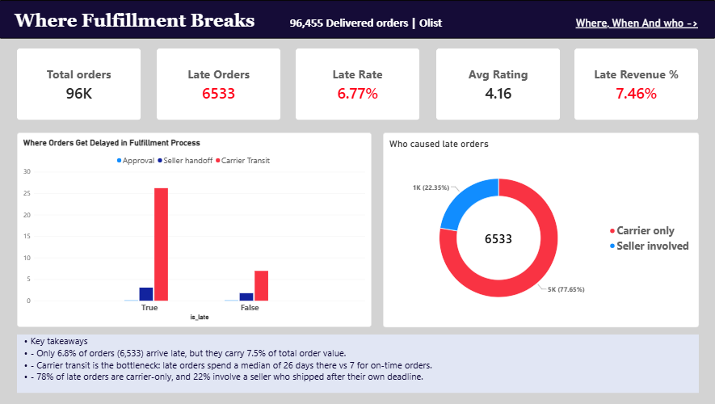
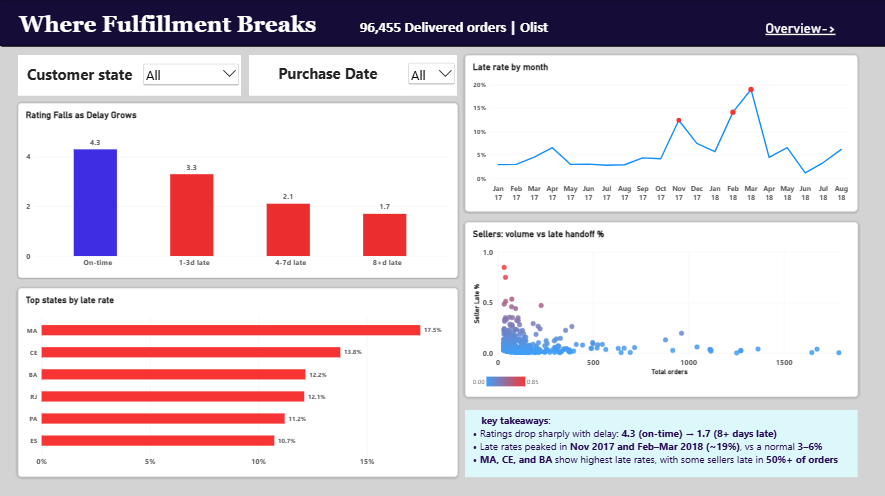

# Where Fulfillment Breaks

**Delivery Delay & Bottleneck Analysis | SQL (PostgreSQL), Python (pandas), Power BI | 96,455 delivered Olist orders**

Late orders hurt customer ratings and tie up revenue, but it is not obvious *where* in the fulfillment process delays start or *who* is responsible. This project splits fulfillment into stages, finds the bottleneck, separates seller delay from carrier delay, and measures the impact on ratings and order value.

---

## Dashboard

**Page 1: Overview**



**Page 2: Where, when and who**



---

## Key findings

| # | Finding | Evidence |
|---|---|---|
| 1 | **6.8% of orders arrive late** | 6,533 of 96,455 orders |
| 2 | **Carrier transit is the bottleneck** | Median 26.2 days for late orders vs 7.0 for on-time. Approval is about 0 days, and seller handoff is 3.1 vs 1.8 days |
| 3 | **78% of late orders are carrier-only** | 77.7% had a seller who met their shipping deadline; 22.3% involved a late seller handoff |
| 4 | **Ratings fall at every step of delay** | Average score 4.29 (on-time), 3.29 (1-3 days late), 2.10 (4-7 days), 1.70 (8+ days) |
| 5 | **Late orders carry 1.15M BRL of order value (7.5% of total)** | 721K BRL of it (63%) received a 1-2 star review |
| 6 | **The northeast is the hotspot** | Late rate: MA 17.5%, CE 13.8%, BA 12.2% (states with 500+ orders), vs 6.8% overall |
| 7 | **Delays spike at peaks** | Nov 2017: 12.4%. Feb 2018: 14.1%. Mar 2018: 19.0%. Typical months: 3-6% |
| 8 | **A few sellers drive the seller-side problem** | Of 615 sellers with 30+ orders, three hand over late in over 53% of their orders (84.8%, 75.0%, 53.4%) |

### What the company should fix first

1. **Carrier transit**, since it accounts for most of the extra time on late orders.
2. **Northeast routes** (MA, CE, BA).
3. **The worst sellers**, starting with the three above.
4. **Capacity planning for peak periods** (Nov 2017, Feb to Mar 2018).

---

## Business questions

1. What % of orders arrive late?
2. Do late deliveries hurt customer ratings?
3. How does the severity of the delay affect ratings?
4. Which fulfillment stage takes the most time?
5. Are delays caused by sellers or carriers?
6. How much revenue is tied to late orders?
7. Which states have the highest late rate?
8. Is lateness getting better or worse over time?
9. Which sellers have the highest late rate?
10. What should the company fix first?

---

## Method

**1. SQL: build one row per order (`order_fact`)**
Items and reviews are summarized *before* joining, so no order or revenue is duplicated. Order items are collapsed to one row per order (count, revenue, freight, latest shipping deadline). Where an order has several reviews, only the latest is kept.

**2. Python: analysis (`notebooks/analysis.ipynb`)**
Stage durations, lateness, delay buckets, fault attribution, ratings, revenue exposed, state, monthly and seller views.

**3. Power BI: two-page dashboard**
KPI cards, stage chart, fault donut, rating by delay, monthly trend, top states, seller scatter, and slicers for state and date.

### Definitions

| Term | Definition |
|---|---|
| **Late order** | Delivery date is after the estimated delivery date. Dates are compared, not timestamps, because the estimate is always at midnight |
| **Delay buckets** | On-time, 1-3 days late, 4-7 days late, 8+ days late |
| **Stages** | Approval (purchase to approval), seller handoff (approval to carrier pickup), carrier transit (carrier pickup to delivery) |
| **Seller late** | The parcel reached the carrier after the seller's own `shipping_limit_date` |
| **Carrier only** | The order was late, but the seller met their shipping deadline |
| **Revenue exposed** | Total order value (price + freight) of late orders. This is **not** lost revenue |
| **Seller late %** | Share of a seller's orders handed to the carrier after the seller's deadline |

### Fault attribution rule

`shipping_limit_date` is the seller's deadline to hand the parcel to the carrier. If the seller missed it, the seller shares responsibility for a late order. If the seller met it and the order was still late, the delay is attributed to the carrier. The rule is deliberately simple and easy to explain.

### Statistical choices

- **Medians for stage times**, because delivery times are right-skewed.
- **Minimum 500 orders per state** and **30 orders per seller**, so tiny groups do not distort the rankings.

---

## Data

Source: [Brazilian E-Commerce Public Dataset by Olist](https://www.kaggle.com/datasets/olistbr/brazilian-ecommerce) on Kaggle. Amounts are in Brazilian reais (BRL). The data covers 2016 to 2018, and the trend chart uses Jan 2017 to Aug 2018, the months with enough orders.

Tables used: `orders`, `order_items`, `customers`, `order_reviews`.

'data/order_fact.csv.zip' is the exported output of the SQL script, included so the notebook runs without a database. The raw Olist tables are not included. Download them from Kaggle to rebuild it.

### Validation checks

- Rows = distinct orders in `order_fact` (no duplication).
- Item revenue in `order_fact` ties back to the raw `order_items` sum.
- Python results (late rate, buckets, fault split) match the SQL results.

### Exclusions

| Step | Orders | Dropped | Reason |
|---|---|---|---|
| All orders | 99,441 | | |
| Status = delivered | 96,478 | 2,963 | Not delivered (shipped, canceled, unavailable, etc.) |
| In `order_fact` | 96,455 | 23 | Marked delivered but missing a timestamp |

Other handling:
- **1,373 orders (1.4%)** have timestamps out of sequence (for example, carrier pickup before approval). They are kept in all metrics but excluded from the stage-time medians.
- **1,275 orders (1.3%)** contain items from several sellers. They have no single `seller_id`, so they are left out of the seller analysis.
- **646 orders** have no review. They are ignored in rating calculations.

---

## Limitations

- **Association, not causation.** Ratings fall as delays grow, but this analysis does not prove delays alone cause the drop.
- **Most reviews of late orders were created before delivery**, because the review survey is sent around the estimated delivery date. The ratings therefore reflect the late arrival itself.
- **Fault attribution is a rule, not proof.** It measures each side against the seller's shipping deadline. It does not show *why* a delay happened, and approval delays are not attributed to either party.
- **Carrier time includes distance.** Far-away customers naturally have longer transit, which is part of why the northeast stands out.
- **Revenue exposed is not revenue lost.** It is the order value attached to late orders, not an estimate of customers who left.
- **Data ends in 2018**, so the findings describe that period, not current performance.

---

## Repository structure

```
where-fulfillment-breaks/
├── README.md
├── sql/
│   └── build_order_fact.sql
├── data/
│   └── data/order_fact.csv.zip
├── notebooks/
│   └── analysis.ipynb
├── dashboard/
│   └── where_fulfillment_breaks.pbix
└── images/
    ├── page1_overview.png
    └── page2_where_when_who.png
```

## How to reproduce

1. Download the Olist dataset from Kaggle and load the four tables into PostgreSQL.
2. Run `sql/build_order_fact.sql` and export the `order_fact` table to `data/order_fact.csv`.
3. Run notebooks/analysis.ipynb top to bottom. It reads 'data/order_fact.csv.zip'.
4. Open `dashboard/where_fulfillment_breaks.pbix` in Power BI Desktop. The data is stored inside the file, so no setup is needed. The dashboard was built from the notebook's output, which adds the lateness flag, delay buckets and fault labels to `order_fact`.

---

## Tools

PostgreSQL, Python (pandas, NumPy, Matplotlib), Power BI (DAX), Jupyter

## Author

**Rajdeep Maheshwari** | [LinkedIn](https://www.linkedin.com/in/rajdeep-maheshwari) | [GitHub](https://github.com/Rajdeep-M)
